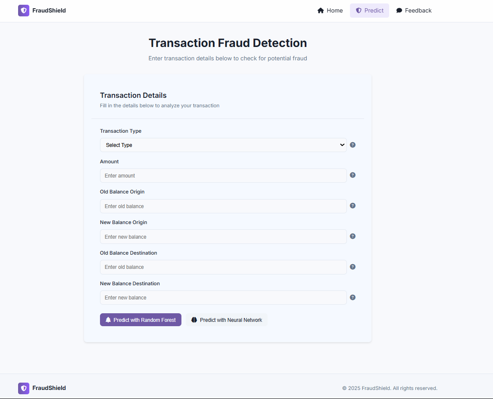
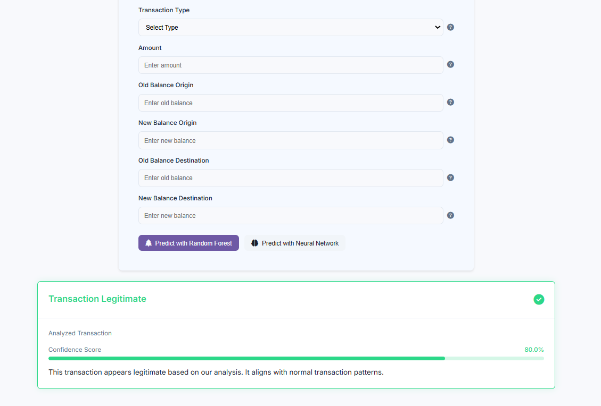
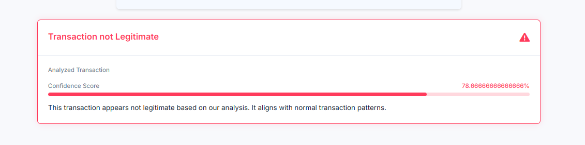
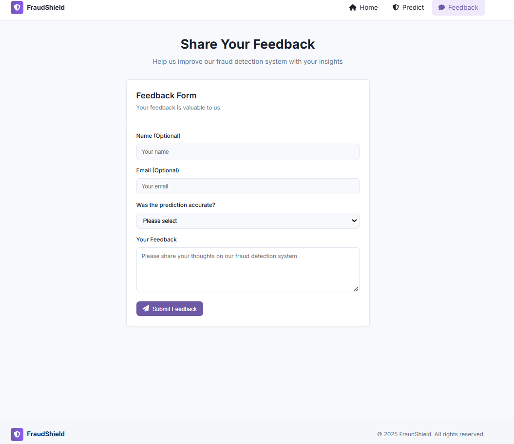

# Online Payment Fraud Detection

This project aims to detect fraudulent online transactions using machine learning models. It includes a Flask-based backend, a responsive HTML/CSS frontend, and pretrained ML models for prediction.

## 📁 Project Structure

ONLINE_PAYMENT_FRAUD_DETECTION/
│
├── backend/                  # Backend logic and ML models
│   ├── app.py                # Flask app entry point
│   ├── data.csv              # Dataset used for training
│   ├── model_nn.pkl          # Neural Network model
│   ├── model_rfc.pkl         # Random Forest Classifier model
│   ├── model.pkl             # Default model (if any)
│   ├── NEURAL.ipynb          # NN training notebook
│   ├── online_fraud.ipynb    # Data analysis & preprocessing
│   └── requirements.txt      # Dependencies
│
├── frontend/                 # Frontend HTML templates
│   ├── index.html            # Home page for input
│   ├── predict.html          # Shows prediction result
│   ├── feedback.html         # Feedback form page
│   └── Readme.md             # Project documentation (this file)
│
├── static/                   # Static assets like styles and images
│   └── styles.css            # Main stylesheet
│
└── .gitignore                # Git ignore file

## 🚀 How to Run the Project

### Prerequisites

- Python 3.7 or above
- pip (Python package installer)

### 1. Set up a Virtual Environment (optional but recommended)

# Create virtual environment
python -m venv venv

# Activate environment:
# On Windows
venv\Scripts\activate

# On Mac/Linux
source venv/bin/activate

### 2. Install Required Dependencies

pip install -r backend/requirements.txt

### 3. Run the Flask App

cd backend
python app.py

The app will run on: http://127.0.0.1:5000

## 🖥️ Screenshots

### 🔹 Home Page  

### 🔹 Prediction Form  

### 🔹 Legitimate Transaction Result  

### 🔹 Fraudulent Transaction Result  

### 🔹 Feedback Page  

## 🧠 Models Used

- Random Forest Classifier (model_rfc.pkl)
- Neural Network (model_nn.pkl)

Switch between models using the app interface.

## 📊 Dataset

Located in backend/data.csv – contains transaction records used for training and evaluation.

## 💡 Features

- Real-time fraud detection using ML models
- Confidence score with animated progress bar
- Clean and user-friendly UI
- Dedicated pages for home, result, and feedback
- Modular code structure

## 🛠 Future Enhancements

- Database logging for transaction history
- User login and authentication
- Cloud deployment (Heroku, AWS, Render, etc.)
- Notification system for fraud alerts

## 📄 License

This project is licensed under the MIT License.